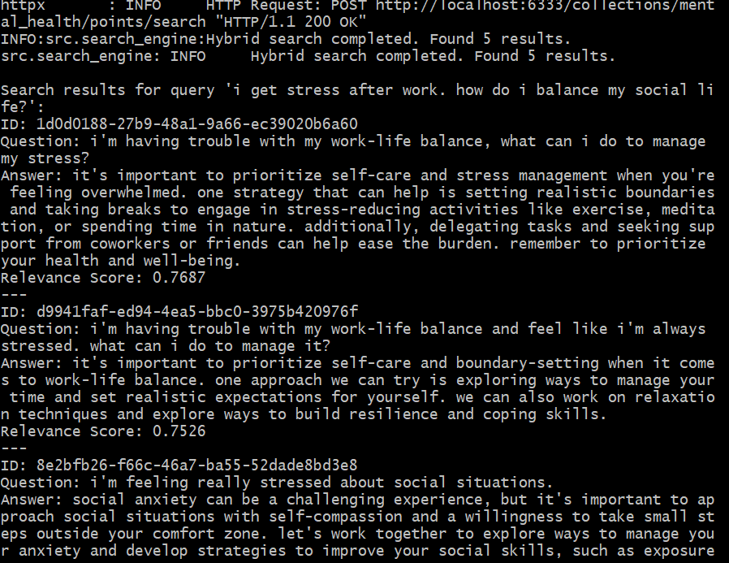
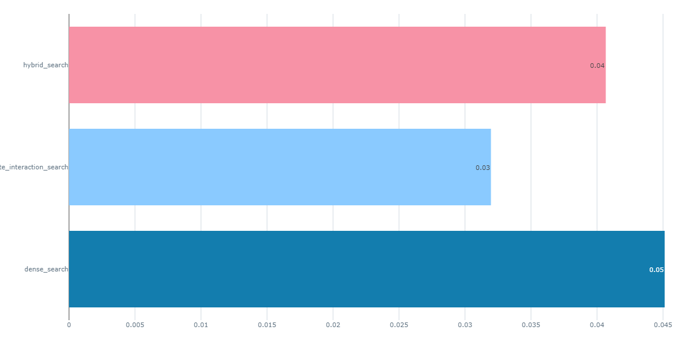

# Mental Health Conversation Project

## Problem Statement

## Description
This project tackles the challenge of delivering reliable and personalized mental health support through conversational AI. By leveraging a Retrieval-Augmented Generation (RAG) flow, it combines the capabilities of both a knowledge base and a Language Model (LLM) to provide accurate, contextually relevant responses in mental health conversations.

## Why It's Important
Reliable and personalized mental health support is crucial for improving well-being and ensuring that individuals receive the right guidance during vulnerable moments. This project aims to enhance the accessibility and effectiveness of mental health care through AI-driven conversations.

## Beneficiaries
This project benefits individuals seeking mental health support, healthcare providers, and the broader mental health community by offering a reliable and scalable solution for mental health conversations.

## Objective
The primary objective is to develop and deploy a conversational AI system that provides accurate and context-sensitive mental health support.

## Key Outcomes
Completion of this project will result in a robust and scalable AI-driven mental health support system, capable of providing personalized and accurate guidance in real time.

## Solution
For local development, Qdrant and open-source LLMs were utilized to ensure robust vector search and model inference. During deployment, Cohere's LLMs were integrated to scale the solution for real-world applications, ensuring a seamless transition from development to production.

## Datasets
The data used in this project was sourced from Hugging Face [Link](https://huggingface.co/datasets/marmikpandya/mental-health)  and Kaggle [Link](https://www.kaggle.com/datasets/narendrageek/mental-health-faq-for-chatbot/data). The datasets were merged and upserted into Qdrant to enable efficient vector search and retrieval within the RAG flow.

## Metrics
Model performance was evaluated using various metrics, including Precision and Normalized Cumulative Gain (NCGC), with NCGC providing the best results.


# Project Structure
```bash
Mental_Health_Convo/Mental_Hea/
├── docker-compose.yaml
├── requirements.txt
├── retrieval_evaluation_results_k5.csv
├── data/
│   ├── generated_questions.parquet
│   ├── hea.parquet
│   ├── Mental_Health_FAQ.csv
│   └── preprocessed_data.parquet
├── deployment/
│   ├── app.py
│   ├── cohere_model.py
│   ├── database.py
│   ├── main.py
│   ├── search_engine.py
│   └── __init__.py
├── evaluation/
│   ├── qdrant_evaluation.py
│   ├── rag_evaluation.py
│   └── __init__.py
├── Images/
│   ├── hybrid1.png
│   ├── hybrid2.png
│   ├── res.png
│   └── res1.png
├── monitoring/
│   ├── app.py
│   ├── database_monitor.py
│   ├── grafana.json
│   └── __init__.py
├── src/
│   ├── .env
│   ├── main.py
│   ├── test.py
│   ├── __init__.py
│   └── core/
│       ├── config.py
│       ├── data_loader.py
│       ├── embeddings_model.py
│       ├── llm_model.py
│       ├── qdrant_manager.py
│       ├── search_engine.py
│       ├── utils.py
│       └── __init__.py
├── tests/
│   ├── __init__.py
│   ├── integration/
│   │   ├── test_integration_deploy.py
│   │   ├── test_integration_monitor.py
│   │   └── __init__.py
│   └── unit/
│       ├── test_core_components.py
│       └── __init__.py
└── ci_cd/
    ├── .github/
    │   └── workflows/
    │       └── ci_cd_pipeline.yaml


```

## Installation

## Clone the repository
```bash
git clone https://github.com/Taciturny/Mental_Health_Convo.git
```

### Change to the project directory
```bash
cd Mental_Health_Convo/Mental_Hea
```
## Reproducibility Steps

### Step 1: Create a Python or Conda Env
```bash 
conda create -n myenv python=3.10.14
conda activate myenv
pip install -r requirements.txt
```

### Step 2: Start Docker Compose and Execute the First Script
Start Docker Compose: Start the services defined in your `docker-compose.yml` file and use the dashboard to view the console:
```bash
docker-compose up -d
http://localhost:6333/dashboard#/console
```

### Step 3: Choose Your Starting Point
`Option 1`: Start Fresh

If you want to start the project from scratch (including data ingestion and preprocessing), run the `data_ingestion_script.py` first from the main. root directory:
```bash
python -m src.data_ingestion_script
```

`Option 2`: Use Preprocessed Data

If you want to use the clean, preprocessed data, skip the data ingestion step and execute the main script directly. Before running this script, ensure you have created a `.env` file and included all the necessary variables defined in `config.py`. This will allow the script to correctly insert data into the knowledge base
```bash
python -m src.main
```
When you run the scrpt, you will have to input a query,  Here is an example of what you will response you will see



### Step 4: Evaluation
Before running the evaluation script, start your MLflow UI, which was installed as part of the requirements:
```bash
mlflow ui
```

`Retrieval Evaluation`
Multiple searches (dense, late-interaction, and hybrid) was evaluated. The best-performing method (dense) is selected for use in deployment. To perform this evaluation, run the following script:

```bash
python -m evaluation.qdrant_evaluation
```
When you run the script, check your MLflow UI to view the runs. You can visualize the different metrics for the three search methods. Below are examples of two metrics: Mean Average Precision (MAP) and Normalized Discounted Cumulative Gain (NDCG)
          

`RAG Evaluation`
```bash
python -m evaluation.rag_evaluation
```

### Step 5: Monitoring
We have to monitor our streamlit app


### Step 6: Deployment
1. Create Accounts and Obtain API Keys

  * Sign up for a free-tier account with Qdrant Cloud to obtain your URL and API key [Quadrant Cloud](https://cloud.qdrant.io/login).
  * Sign up for a free-tier account with Cohere to get your trial API key [Cohere API](https://dashboard.cohere.com/api-keys).
  * Save these credentials in your .env file.

2. Upsert Data to Qdrant Cloud
   Before deploying your app, run main.py to upsert data to Qdrant Cloud (using a sample size of your choice). Execute the following command:

```bash
python -m deployment.main
```

3. Deploy and Access the App
If you choose not to upsert data manually, you can still assess the app. The mental health chatbot is deployed on Render. You can access it here.


### Step 7: Tests (Unit and Integration Tests)

1. To run the unit tests, execute:

    ```bash
      pytest tests/unit/test_core_components.py
    ```

2. To run the integration tests, execute:

    ```bash
    pytest tests/integration/test_integration.py
    ```
