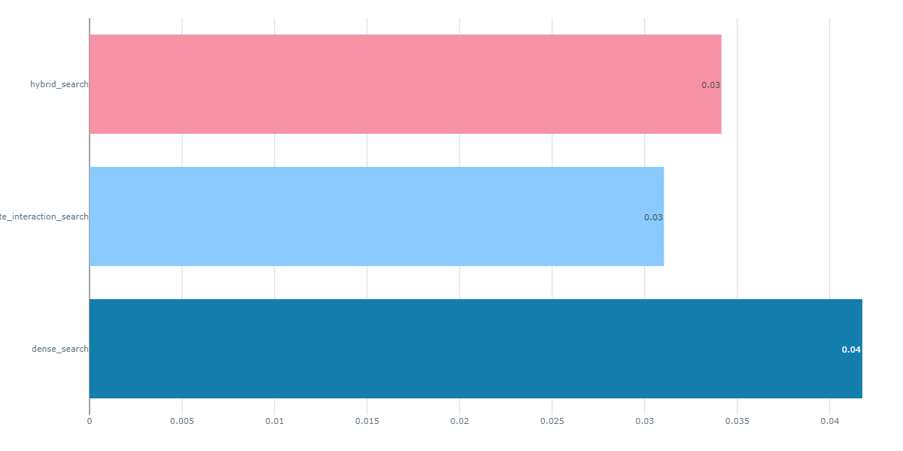

# Mental Health Conversation Project

## Problem Statement

## Description
This project tackles the challenge of delivering reliable and personalized mental health support through conversational AI. By leveraging a Retrieval-Augmented Generation (RAG) flow, it combines the capabilities of both a knowledge base and a Language Model (LLM) to provide accurate, contextually relevant responses in mental health conversations.

## Why It's Important
Reliable and personalized mental health support is crucial for improving well-being and ensuring that individuals receive the right guidance during vulnerable moments. This project aims to enhance the accessibility and effectiveness of mental health care through AI-driven conversations.

## Beneficiaries
This project benefits individuals seeking mental health support, healthcare providers, and the broader mental health community by offering a reliable and scalable solution for mental health conversations.

## Objective
The primary objective is to develop and deploy a conversational AI system that provides accurate and context-sensitive mental health support.

## Key Outcomes
Completion of this project will result in a robust and scalable AI-driven mental health support system, capable of providing personalized and accurate guidance in real time.

## Solution
For local development, Qdrant and open-source LLMs were utilized to ensure robust vector search and model inference. During deployment, Cohere's LLMs were integrated to scale the solution for real-world applications, ensuring a seamless transition from development to production.

## Datasets
The data used in this project was sourced from Hugging Face [Link](https://huggingface.co/datasets/marmikpandya/mental-health)  and Kaggle [Link](https://www.kaggle.com/datasets/narendrageek/mental-health-faq-for-chatbot/data). The datasets were merged and upserted into Qdrant to enable efficient vector search and retrieval within the RAG flow.

## Metrics
Model performance was evaluated using various metrics, including Precision and Normalized Cumulative Gain (NCGC), with NCGC providing the best results.

Overall Project Structure     

# Project Structure
```bash
Mental_Health_Convo/
├── .github/
│   └── workflows/
│       └── ci-cd.yml          # GitHub Actions workflow for CI/CD
├── .gitignore
├── README.md                  # Project documentation
├── dataset_processing.py       # Script to load, merge, clean, and process datasets
├── ground_truth.ipynb          # Notebook for creating ground truth using llama2
├── Mental_Hea/
│   ├── chatbot.db              # SQLite database
│   ├── docker-compose.yaml     # Docker Compose setup for the application
│   ├── requirements-dev.txt    # Dev requirements for Python
│   ├── data/                   # Data files
│   │   ├── generated_questions.parquet
│   │   ├── hea.parquet
│   │   ├── Mental_Health_FAQ.csv
│   │   └── preprocessed_data.parquet
│   ├── deployment/             # Deployment-related scripts
│   │   ├── cohere_model.py
│   │   ├── database.py
│   │   ├── deploy_app.py
│   │   ├── main.py
│   │   ├── requirements.txt
│   │   └── search_engine.py
│   ├── evaluation/             # Evaluation scripts
│   │   ├── qdrant_evaluation.py
│   │   ├── rag_evaluation.py
│   └── monitoring/             # Monitoring setup for Grafana and database
│       ├── app.py
│       ├── database_monitor.py
│       └── grafana.json
│   ├── src/                    # Core source code
│   │   ├── .env                # Environment variables
│   │   ├── core/
│   │   │   ├── config.py
│   │   │   ├── data_loader.py
│   │   │   ├── embeddings_model.py
│   │   │   ├── llm_model.py
│   │   │   ├── qdrant_manager.py
│   │   │   └── search_engine.py
│   └── tests/                  # Unit and integration tests
│       ├── integration/
│       │   ├── test_integration.py
│       └── unit/
│           └── test_core_components.py
```

## Installation

## Clone the repository
```bash
git clone https://github.com/Taciturny/Mental_Health_Convo.git
```

### Change to the project directory
```bash
cd Mental_Health_Convo/Mental_Hea
```
## Reproducibility Steps

### Step 1: Create a Python or Conda Env
```bash
conda create -n myenv python=3.10.14
conda activate myenv
pip install -r requirements-dev.txt
```

### Step 2: Start Docker Compose and Execute the First Script
Start Docker Compose: Launch the services defined in your `docker-compose.yml` file. Ensure that you have edited the file to include your PostgreSQL and Grafana usernames and passwords. Once Docker Compose is running, access the dashboard to view the console:
```bash
docker-compose up -d
http://localhost:6333/dashboard#/console
```

### Step 3: Choose Your Starting Point
`Option 1`: Start Fresh

If you want to start the project from scratch (including data loading, cleaning and preprocessing), run the `dataset_processing.py` first from the root directory:
```bash
python -m dataset_processing
```

`Option 2`: Use Preprocessed Data

If you want to use the clean, preprocessed data, skip the data ingestion step and execute the main script directly. Before running this script, ensure you have created a `.env` file and included all the necessary variables defined in `config.py`. This will allow the script to correctly insert data into the knowledge base
```bash
python -m src.main
```
When you run the scrpt, you will have to input a query,  Here is an example of the response you will see


### Step 4: Evaluation
Before running the evaluation script, start your MLflow UI, which was installed as part of the requirements:
```bash
mlflow ui
```

`Retrieval Evaluation`
Multiple searches (dense, late-interaction, and hybrid) was evaluated. The best-performing method (dense) is selected for use in deployment. Please note that running the rag evaluation will take a long time for cpu users (almost 20hrs). To perform this evaluation, run the following script:

```bash
python -m evaluation.qdrant_evaluation
```
When you run the script, check your MLflow UI to view the runs. You can visualize the different metrics for the three search methods. Below are examples of two metrics: Mean Average Precision (MAP) and Normalized Discounted Cumulative Gain (NDCG)



`RAG Evaluation`
```bash
python -m evaluation.rag_evaluation
```

### Step 5: Monitoring

To effectively monitor our Streamlit app, follow these steps:

1. Review the Local Monitoring App: Watch the brief video demonstrating the local monitoring application using open-source Qdrant [Monitoring_app](https://drive.google.com/file/d/1PwFlH2nVBDL7SUkIGI8xUavKIRqwgwTc/view?usp=sharing). Please note that the application may run slowly due to the use of localhost and CPU-based open-source models.

2. Configure Grafana: Ensure that Grafana is running. You can either create a new dashboard and upload the `grafana.json` file or manually copy each query from the `database_monitor.py` file and paste them into Grafana.


### Step 6: Deployment
1. Create Accounts and Obtain API Keys

  * Sign up for a free-tier account with Qdrant Cloud to obtain your URL and API key [Quadrant Cloud](https://cloud.qdrant.io/login).
  * Sign up for a free-tier account with Cohere to get your trial API key [Cohere API](https://dashboard.cohere.com/api-keys).
  * Save these credentials in your .env file.

2. Upsert Data to Qdrant Cloud

   Before deploying your app, run main.py to ingest/upsert data to Qdrant Cloud (using a sample size of your choice). Execute the following command:

```bash
python -m deployment.main
```

3. Deploy and Access the App

  If you prefer not to upsert data manually, you can still explore the app. The mental health chatbot is deployed on Streamlit, and you can access it[Streamlit App](https://mentalhealthconvo-eb5wdksv8fihwr9danfurp.streamlit.app/).
  To view the `metrics page`, use the password `1234` (this is a temporary password and will be updated later).


### Step 7: Tests (Unit and Integration Tests)

1. To run the unit tests, execute:

    ```bash
      pytest tests/unit/test_core_components.py
    ```

2. To run the integration tests, execute:

    ```bash
    pytest tests/integration/test_integration.py
    ```

### Step 8: CI/CD

1. GitHub Actions Configuration

Configure GitHub Actions to automate testing and linting for the project. The configuration file is located at `github/workflows/ci-cd.yml`

2. Workflow Details

**Test Job**: This job sets up Python, installs dependencies, and runs tests using `pytest`.

**Lint Job**: This job performs linting checks with `flake8` to ensure code quality and adherence to style guidelines.

3. Triggering CI/CD

**Push**: GitHub Actions will automatically run tests and linting checks every time you push changes to the main branch.

**Pull Request**: The workflow will run whenever a pull request is opened against the main branch to verify that the proposed changes meet quality standards.

4. Viewing Results

Check the status and results of your CI/CD runs in the `Actions` tab of the GitHub repository.
